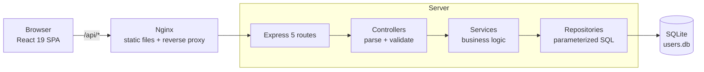

# User Directory

## Project overview

A full-stack user directory. The server keeps 1,000 seeded people in SQLite and exposes a small read-only REST API with search, filtering, sorting and pagination. The React client renders a virtualized infinite-scroll list with sidebar facets (top 20 hobbies and nationalities that reflect the active filters), keeps its search/filter state in the URL, and sits behind a cookie-based login.

## Architecture diagram



In local development Nginx is replaced by the Vite dev server proxy (`5173` → `3001`).

## Tech stack

| Layer | Choices |
| --- | --- |
| Client | React 19, TypeScript 5.8, Vite 6, Tailwind CSS 4, TanStack Query 5, React Router 7, Redux Toolkit (scaffold) |
| Server | Node 24, Express 5, `sqlite` / `sqlite3`, dotenv, cors |
| Tooling | npm workspaces + Lerna, concurrently, Vitest + Testing Library, Node built-in test runner |
| Runtime | Docker Compose (Node service + Nginx service + named volume) |

## Project structure

```
client/        React SPA (api/, hooks/, pages/, components/, store/, utils/)
server/        Express API (routes → controllers → services → repositories → database)
server/test/   API and database-initialization tests
docker-compose.yml
```

## How to run locally

```bash
cp server/.env.example server/.env
cp client/.env.example client/.env
npm ci
npm run dev
```

- Client: http://localhost:5173 · Server: http://localhost:3001 · Login: `admin` / `admin`
- The database file, schema and seed data are created automatically on first start.

Useful workspace scripts:

```bash
npm run dev --workspace=server        # nodemon
npm run migrate --workspace=server    # schema only
npm run seed --workspace=server       # reseed (stop the server first)
npm run build --workspace=client      # tsc -b && vite build
npm run typecheck --workspace=client
```

## How to run with Docker

```bash
docker compose up --build
```

- Client: http://localhost (Nginx, port `CLIENT_PORT`, default `80`)
- Server: http://localhost:3001 (port `API_PORT`, default `3001`)
- The client waits for the server healthcheck (`/api/health`) before starting.
- SQLite data lives in the named volume `db-data` mounted at `/app/data`.

Key environment variables: `API_PORT`, `CLIENT_PORT`, `API_BASE_URL`, `CLIENT_ORIGIN`, `COOKIE_SECURE`, `DATABASE_PATH`, `LOG_LEVEL`.

Container logs are single-line JSON, so `docker compose logs server` can be piped into `jq`.

## API endpoints

| Method | Path | Auth | Description |
| --- | --- | --- | --- |
| `GET` | `/api/health` | no | Liveness and database readiness |
| `POST` | `/api/auth/login` | no | Sign in, sets an HTTP-only session cookie |
| `GET` | `/api/auth/me` | yes | Current account, or 401 |
| `POST` | `/api/auth/logout` | yes | Revoke session and clear cookie |
| `GET` | `/api/users` | yes | Paginated, filtered, sorted users |
| `GET` | `/api/filters` | yes | Top 20 hobbies and nationalities in one request |
| `GET` | `/api/hobbies` | yes | Top 20 hobbies for the current filters |
| `GET` | `/api/nationalities` | yes | Top 20 nationalities for the current filters |

Responses use a `{ data, pagination }` envelope; errors return a sanitized message plus field details for validation failures.

## Query parameters

Shared by `/api/users`, `/api/filters`, `/api/hobbies`, `/api/nationalities`:

| Param | Type | Default | Notes |
| --- | --- | --- | --- |
| `q` | string | – | Case-insensitive substring on `first_name` or `last_name`, max 100 chars |
| `nationality` | string or repeated | – | OR semantics, max 50 values, validated against the vocabulary |
| `hobby` | string or repeated | – | AND semantics, max 10 values, validated against the vocabulary |

Additional parameters for `/api/users`:

| Param | Type | Default | Notes |
| --- | --- | --- | --- |
| `sortBy` | enum | `first_name` | `first_name`, `last_name`, `age`, `nationality` |
| `sortOrder` | enum | `asc` | `asc`, `desc` |
| `page` | integer | `1` | 1-based |
| `limit` | integer | `20` | Max `100` |

Unknown or out-of-range values return HTTP 400.

## Database structure

| Table | Columns |
| --- | --- |
| `users` | `id`, `avatar`, `first_name`, `last_name`, `age` (0–150), `nationality`, `created_at`, `updated_at` |
| `hobbies` | `id`, `name` (unique) |
| `user_hobbies` | `user_id`, `hobby_id` (composite PK, cascading FKs) |
| `accounts` | `id`, `username` (unique), `password_hash` |
| `sessions` | `token_hash` (PK), `account_id`, `expires_at` |

Indexes cover name search (`NOCASE` collations with an `id` tie-breaker), `nationality`, `age`, the `hobby_id, user_id` join path, and session expiry. WAL mode and `PRAGMA foreign_keys = ON` are enabled on connect.

## Testing instructions

```bash
npm test --workspace=server   # node --test test/*.test.js
npm test --workspace=client   # vitest
```

Server tests cover query validation, filter semantics, pagination metadata, auth, error handling and the database-initialization lifecycle against an in-memory SQLite database. Client tests cover the directory page, query hooks, auth hooks and URL-state utilities.

## Design / performance decisions

- Filtering, sorting and pagination happen in SQL, so only one page of rows crosses the wire.
- Hobbies are aggregated in the same query with a join and `GROUP_CONCAT`, avoiding N+1 lookups.
- Facet counts are recomputed from the active filter predicates, so the sidebar never shows stale options.
- Every sort adds `id ASC` as a tie-breaker to keep paging deterministic.
- The client debounces search input by 300 ms and cancels in-flight requests with abort signals.
- TanStack Query caches results (5 min fresh / 15 min retained); the list is virtualized so only visible rows render.
- Errors pass through one middleware that maps them to 400/401/404/405/500 with sanitized messages.
- Every request logs one structured JSON line (request id, method, endpoint, status code, response time); 5xx failures add the original error. Bodies, headers, cookies and credential-like values are redacted. See [Error Handling](error-handling.md).

## Architecture decisions

**Why server-side pagination?**
→ Avoid transferring the entire dataset and keep memory flat as the table grows.

**Why SQLite?**
→ Required by the assignment and sufficient for local persistence with zero setup.

**Why a layered API boundary (route → controller → service → repository)?**
→ Keeps the database implementation independent from the React client and testable in isolation.

**Why indexes?**
→ Improve the frequently used name-search, nationality/age sort and hobby-join queries.

**Why parameterized queries and an allowlist for sort fields?**
→ Prevents SQL injection and lets SQLite reuse query plans.

**Why URL-owned filter state?**
→ Makes views shareable and restores correctly on reload or back-navigation.

**Why TanStack Query instead of Redux for server data?**
→ Caching, revalidation and cancellation come for free; Redux stays as an unused scaffold.

**Why HTTP-only session cookies?**
→ Tokens stay out of JavaScript and local storage; `SameSite` limits CSRF exposure.

**Why a Docker volume?**
→ Prevents SQLite data loss (db, WAL and shm files) when containers restart or are rebuilt.
